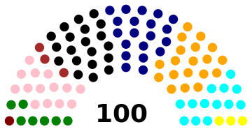
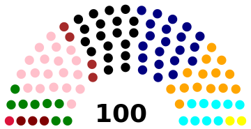
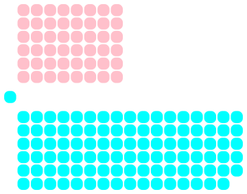
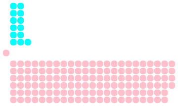

# Election simulation
A collection of implementations and simulations of elections with a large variety of electoral systems. Implementations are included both for systems designed for single-member constituencies (such as First Past The Post and Instant Runoff Voting) and those used in multi-member constituencies (party list PR).

## Examples uses of econf.py:

### Multi-party system (default)

As a default, the political positions (economic and social) of parties are all initialised relatively close to the centre. The voters have their own positions and vote for the party closest to them. This does not result in a clear victory for any of the parties, as the votes are distributed among them fairly evenly.

Under such circumstances, parliaments are commonly elected by proportional representation, meaning that parties receive seats in proportion to their share of the votes.

To illustrate this, we shall run the simulation using a 100-member parliament elected through party-list proportional representation with the <a href=https://en.wikipedia.org/wiki/Largest_remainder_method>largest remainder method</a> (<a href=https://en.wikipedia.org/wiki/Hare_quota>Hare quota</a>).

```
In [1]: elcyc(1,"listPR",100,"lr","fins",pres=(1,"TRS","s"))
[('Navy', 137893), ('Black', 134289), ('Orange', 130053), ('Pink', 96005), ('Cyan', 91574), ('Green', 48749), ('Yellow', 19944), ('Brown', 19525), ('Maroon', 7756), ('Crimson', 1430)]
[('Navy', 20.07), ('Black', 19.54), ('Orange', 18.92), ('Pink', 13.97), ('Cyan', 13.33), ('Green', 7.09), ('Yellow', 2.9), ('Brown', 2.84), ('Maroon', 1.13), ('Crimson', 0.21)]

[('Navy', 20), ('Black', 20), ('Orange', 19), ('Pink', 14), ('Cyan', 13), ('Green', 7), ('Brown', 3), ('Yellow', 3), ('Maroon', 1)]
[('Navy', 20.0), ('Black', 20.0), ('Orange', 19.0), ('Pink', 14.0), ('Cyan', 13.0), ('Green', 7.0), ('Brown', 3.0), ('Yellow', 3.0), ('Maroon', 1.0)]
[('Navy', +20), ('Black', +20), ('Orange', +19), ('Pink', +14), ('Cyan', +13), ('Green', +7), ('Brown', +3), ('Yellow', +3), ('Maroon', +1)]
Out[1]: (['Black', 'Orange', 'Pink'], 53)
```


The first election results in a parliament where even the largest parties only have 20% of the seats, corresponding to similar percentages of the votes (votes and vote percentages are shown first, seats and seat percentages after that, followed by gains/losses of seats by parties). In such a situation, it would be hard for any party to govern alone. Therefore, the parties that are closest to each other (while having a combined majority) form a coalition government. 

In this simulation, the most likely coalition is defined as the set of parties forming a majority where the maximum political distance between any two parties within it is smallest. In our case, the government is formed by the Black Party, Orange Party and Pink Party, all of which are centrist parties.
```
In [2]: elcyc(1,"listPR",100,"lr","fins",pres=(1,"TRS","s"))
[('Navy', 146648), ('Pink', 132079), ('Black', 131024), ('Orange', 98445), ('Cyan', 64346), ('Green', 57946), ('Brown', 25868), ('Maroon', 16843), ('Yellow', 9995), ('Crimson', 4024)]
[('Navy', 21.34), ('Pink', 19.22), ('Black', 19.07), ('Orange', 14.33), ('Cyan', 9.36), ('Green', 8.43), ('Brown', 3.76), ('Maroon', 2.45), ('Yellow', 1.45), ('Crimson', 0.59)]

[('Navy', 21), ('Pink', 19), ('Black', 19), ('Orange', 14), ('Cyan', 9), ('Green', 8), ('Brown', 4), ('Maroon', 3), ('Yellow', 2), ('Crimson', 1)]
[('Navy', 21.0), ('Pink', 19.0), ('Black', 19.0), ('Orange', 14.0), ('Cyan', 9.0), ('Green', 8.0), ('Brown', 4.0), ('Maroon', 3.0), ('Yellow', 2.0), ('Crimson', 1.0)]
[('Navy', +1), ('Pink', +5), ('Black', -1), ('Orange', -5), ('Cyan', -4), ('Green', +1), ('Brown', +1), ('Maroon', +2), ('Yellow', -1), ('Crimson', +1)]
Out[2]: (['Pink', 'Black', 'Orange'], 52)
```

The second election produces small changes in the seat counts of each party, but the overall situation is the same as in the last election. The ruling coalition now has fewer seats but retains its majority.

We have defined a system for electing the president/head of state. In such cases, every third election is used for presidential election. Our system of choice is the two-round system (the <a href=https://en.wikipedia.org/wiki/Contingent_vote>contingent vote</a> to be more precise), where the voters rank each candidate and the top two candidates in terms of first-preference votes advance to the second round of counting, where votes for eliminated candidates are transferred to them according to the voters' preferences. The one of the two who is ranked above the other by the most voters is elected.

```
In [3]: elcyc(1,"listPR",100,"lr","fins",pres=(1,"TRS","s"))
An election in the 1 constituency
has been conducted under the Two-Round System.
The first round results are as follows:

Navy :  163261  (23.76 pct)

Black : 136930  (19.93 pct)

Pink :  106506  (15.50 pct)

Orange :        101891  (14.83 pct)

Cyan :  76435   (11.12 pct)

Green : 40986   (5.96 pct)

Brown : 30837   (4.49 pct)

Yellow :        16325   (2.38 pct)

Maroon :        11981   (1.74 pct)

Crimson :       2066    (0.30 pct)


Navy
and
Black
advance to the second round.

The second round results are as follows:

Black : 471686  (68.64 pct)

Navy :  215532  (31.36 pct)

Black is elected by a margin of 256154 votes.
[('Black', +1)]
Black win

```
Navy received the most votes in the first round, and would have won under First Past the Post, but lost the election because the electorate as a whole preferred Black.


### Two-party system

Here we use <tt>twoppos</tt> as our set of party positions, which is designed to produce a two-party system where Cyan and Pink are the only parties close to the centre ground, which is where most voters are.

We shall use First Past the Post (common in two-party systems) in 150 constituencies as our parliamentrary electoral system.

```
In [1]: e.positions = twoppos

In [2]: elcyc(150,"FPTP","wm","fins")
[('Cyan', 417214), ('Pink', 390239), ('Orange', 61187), ('Navy', 1050)]
[('Cyan', 47.97), ('Pink', 44.87), ('Orange', 7.04), ('Navy', 0.12)]

[('Cyan', 102), ('Pink', 48)]
[('Cyan', 68.0), ('Pink', 32.0)]
[('Cyan', +102), ('Pink', +48)]
Out[2]: (['Cyan'], 102)
```
The first election results in a comfortable win for the Cyan Party, which forms a government alone as its 102 seats give it a majority in the 150-seat parliament. Note that the Orange Party, which might have been entitled to around 10 seats under a proportional system, wins no seats at all, as it fails to win the most votes in any individual constituency.



```
In [3]: elcyc(150,"FPTP","wm","fins")
[('Pink', 520088), ('Cyan', 291374), ('Orange', 56963), ('Navy', 1265)]
[('Pink', 59.8), ('Cyan', 33.5), ('Orange', 6.55), ('Navy', 0.15)]

[('Pink', 137), ('Cyan', 13)]
[('Pink', 91.33), ('Cyan', 8.67)]
[('Pink', +89), ('Cyan', -89)]
Out[3]: (['Pink'], 137)
```

After a term of Cyan Party rule, another election is held. The voters are dissatisfied with the incumbent government and their political positions drift away from that of the Cyan party. For many voters who previously voted Cyan, this makes the Pink Party closest to them, which causes them to vote for it. As a result, the Pink Party wins by a landslide, taking 137 seats.

